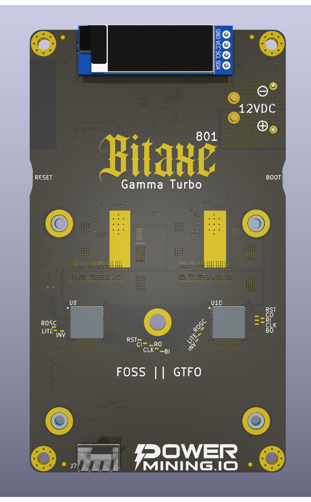
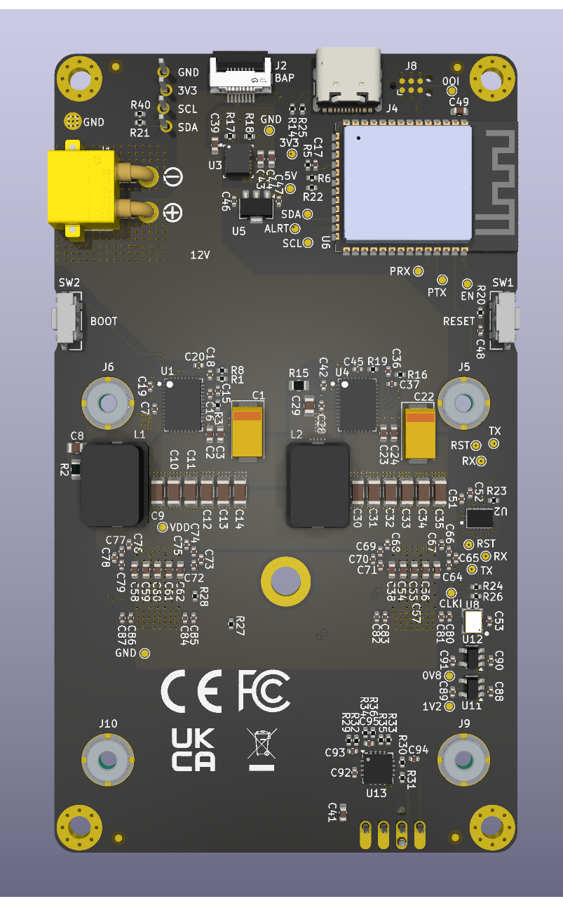

# Bitaxe Gamma Turbo

Bitaxe Gamma Turbo is a dual BM1370 Open Source Bitcoin miner using [esp-miner](https://github.com/bitaxeorg/esp-miner). This project aims to provide a high-performance, energy-efficient Bitcoin mining solution using modern ASIC hardware.

## Version

The first release of the Bitaxe Gamma Turbo (GT) marks the version 801.

Major improvements over the version 800xxx are changes in the selected components and refitting components and headers on the PCB.

## Features

- Dual BM1370 ASIC
- Dual TPS546*
- Improved Mounting Hole selection
- 12V BAP
- EMC2103

The Bitaxe Gamma Turbo is the first iteration of a dual ASIC chip variant and marks the first point of multi-chip devices with modern ASIC hardware.

